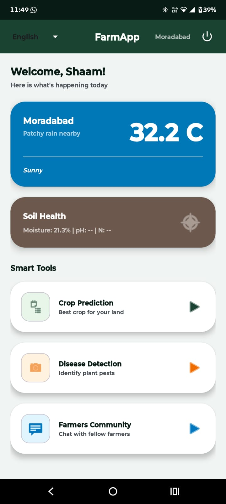
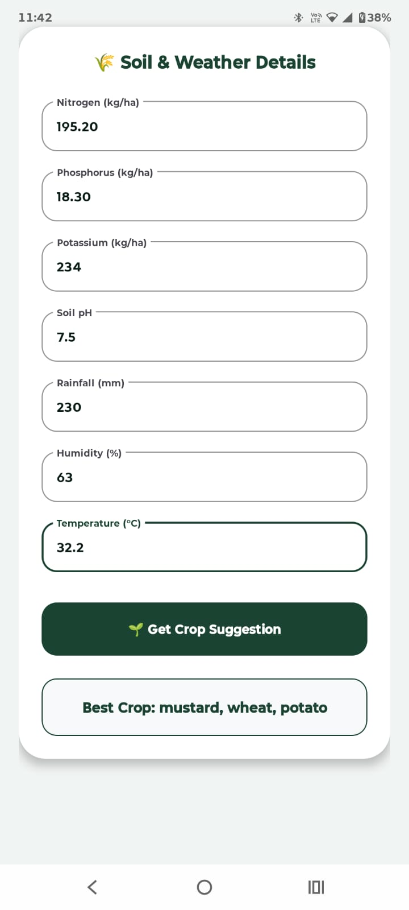
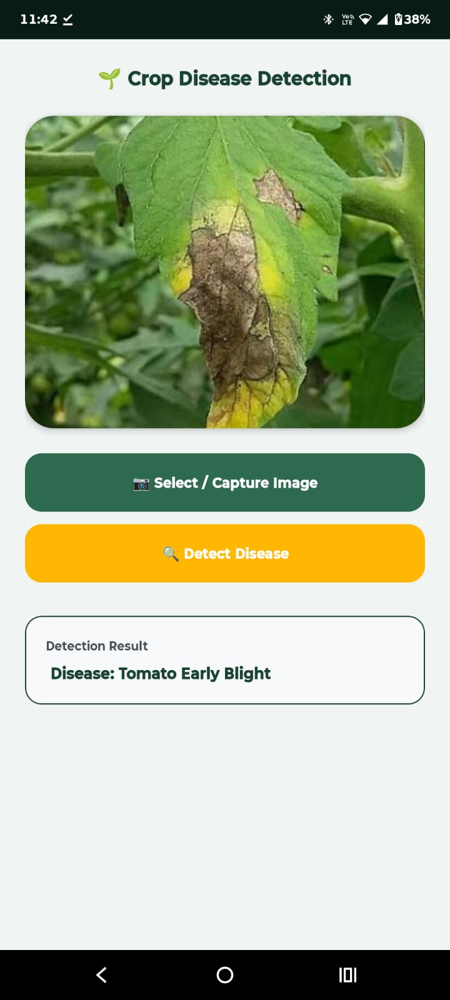
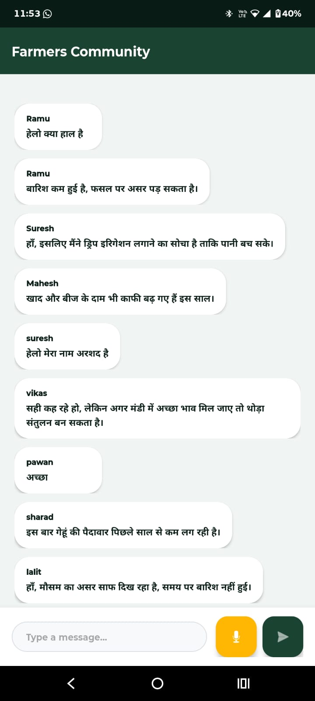
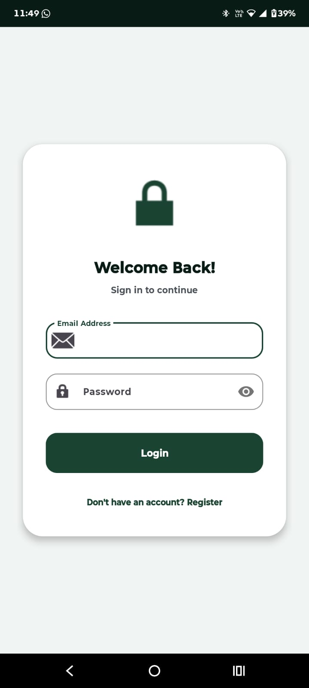
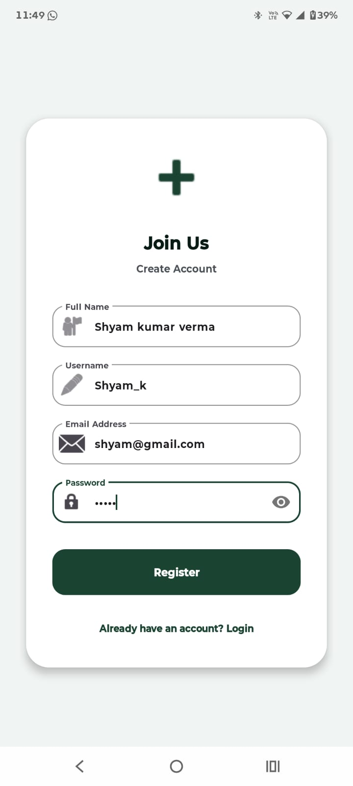

# Farm App

Farm App is an Android application for farmers that combines crop prediction, soil and weather awareness, plant disease detection, translation support, and a farmer community chat experience in one place. The app is designed to help farmers make faster field decisions using simple inputs, live location-based data, and on-device machine learning.

## Screenshots

Add screenshots to `docs/screenshots/` with the filenames below and they will render automatically on GitHub.

| Dashboard | Crop Prediction | Disease Detection |
| --- | --- | --- |
|  |  |  |

| Farmers Community | Login | Register |
| --- | --- | --- |
|  |  |  |

## Features

- Crop prediction from soil nutrients and environmental values.
- Plant disease detection from selected crop/leaf images using a TensorFlow Lite model.
- Farmers community chat with username-based message cards.
- User authentication with Firebase Email/Password login and registration.
- Username collection during signup and profile storage in Firebase Realtime Database.
- Location-based weather updates using the device's current location.
- Location-based soil health data, including moisture, pH, temperature, and fertility values.
- Reverse-geocoded location display so the dashboard can show a readable place name.
- Speech-to-text support in the farmer community message box.
- Multi-language support with English and Hindi options.
- ML Kit translation integration for weather and soil information.
- Modern Material-style dashboard cards for weather, soil health, crop prediction, disease detection, and community access.

## Feature Highlights

### Crop Prediction

The crop prediction module helps farmers choose suitable crops using soil and climate inputs. The user enters values such as nitrogen, phosphorus, potassium, pH, rainfall, humidity, and temperature. The app compares these values against crop range data stored in `Crop_Ranges_MinMax.csv` and returns the best matching crop suggestions.

Key points:

- Uses local CSV crop range data from `app/src/main/assets/Crop_Ranges_MinMax.csv`.
- Accepts N, P, K, pH, rainfall, humidity, and temperature inputs.
- Checks for exact matches across all input ranges.
- Falls back to nearest crop suggestions using normalized distance when no exact crop match exists.
- Runs locally without needing a crop prediction server.

### Plant Disease Detection

The disease detection module allows users to select an image from the gallery and run disease classification on-device. The image is resized to the model input size and passed through a TensorFlow Lite model stored in the app assets.

Key points:

- Uses `model_unquant.tflite` for on-device inference.
- Uses `labels.txt` for readable disease labels.
- Accepts crop/leaf images from the device gallery.
- Resizes images to `224 x 224` before classification.
- Works without sending the selected image to a remote server.

### Farmers Community

The farmers community module gives users a shared chat space backed by Firebase Realtime Database. Registered users can send messages with their chosen username, making the chat feel personal and easier to follow.

Key points:

- Requires Firebase login before entering the community.
- Stores profile data with full name, username, and email.
- Displays the sender username on each message card.
- Uses Firebase Realtime Database for group chat messages.
- Includes speech-to-text support for quickly writing messages by voice.

### Weather and Soil Awareness

The dashboard fetches the device location, converts it into a readable place name, and uses coordinates for weather and soil API calls. Weather data is used for current and forecast conditions, while soil data supports field awareness with values such as moisture, pH, temperature, and fertility.

Key points:

- Uses Google Play Services Location for current location.
- Shows a readable place name instead of raw latitude and longitude.
- Uses WeatherAPI for weather forecasts.
- Uses Ambee Soil API for soil health data.
- Supports translated weather and soil display through ML Kit Translate.

## Tech Stack

- **Language:** Kotlin and Java
- **Platform:** Android
- **Architecture:** MVVM-style separation with ViewModel, Repository, Retrofit network layer, and model classes
- **Backend Services:** Firebase Authentication and Firebase Realtime Database
- **Networking:** Retrofit, OkHttp, Gson
- **Location:** Google Play Services Location
- **Machine Learning:** TensorFlow Lite
- **Translation:** Google ML Kit Translate
- **UI:** AndroidX, AppCompat, Material Components, ConstraintLayout, CardView
- **Image Loading:** Glide
- **Async Work:** Kotlin Coroutines and Android Lifecycle components

## Main Libraries

| Library | Purpose |
| --- | --- |
| AndroidX Core KTX | Kotlin-friendly Android APIs |
| AppCompat | Backward-compatible Android UI support |
| Material Components | Material UI widgets and styling |
| ConstraintLayout | Flexible screen layouts |
| Lifecycle ViewModel / LiveData | MVVM state management |
| Navigation Fragment / UI | Android navigation support |
| Retrofit | REST API client |
| Gson Converter | JSON serialization/deserialization for Retrofit |
| OkHttp | HTTP client and logging |
| Kotlin Coroutines | Background and asynchronous operations |
| Play Services Location | Current device location fetching |
| Firebase Auth KTX | User login and registration |
| Firebase Realtime Database KTX | Community chat and user profile storage |
| ML Kit Translate | Text translation |
| TensorFlow Lite | On-device plant disease model inference |
| Glide | Image loading |
| CardView | Card-based UI components |
| JUnit / Espresso | Unit and instrumentation testing |

## Project Structure

```text
app/src/main/java/com/example/farmapp/
+-- data/
|   +-- model/          # Weather, soil, and resource response models
|   +-- network/        # Retrofit API interfaces and clients
|   +-- repository/     # Repository for weather and soil data
+-- ui/
|   +-- view/           # Activities and community chat UI
|   +-- viewmodel/      # Main dashboard ViewModel and factory
+-- utils/              # Config, language, and translation helpers
```

## Screens and Modules

- **LoginActivity:** Handles Firebase user login.
- **RegisterActivity:** Creates a user account and saves name/username profile data.
- **MainActivity:** Main farmer dashboard with weather, soil, location, language selector, and feature cards.
- **CropInputActivity:** Collects soil and environment values, then recommends suitable crops.
- **DiseaseDetectionActivity:** Runs plant disease detection using a TensorFlow Lite model.
- **community:** Farmer community chat with username display and speech-to-text input.

## APIs and Services

The app uses external APIs for live weather and soil data:

- Weather API: `https://api.weatherapi.com/v1/`
- Soil API: `https://api.ambeedata.com/soil/`

API keys are currently read from:

```text
app/src/main/java/com/example/farmapp/utils/Config.kt
```

For production, move API keys out of source control and load them from a secure configuration source such as `local.properties`, Gradle BuildConfig fields, or a backend proxy.

## Setup

1. Clone the repository.
2. Open the project in Android Studio.
3. Add a valid Firebase project configuration file:

```text
app/google-services.json
```

4. Add valid WeatherAPI and Ambee API keys in `Config.kt`.
5. Sync Gradle.
6. Build and run the app on an Android device or emulator.

## Build

```bash
./gradlew assembleDebug
```

On Windows:

```powershell
.\gradlew.bat assembleDebug
```

## Permissions

The app requires:

- Internet access for Firebase, weather, soil, and translation services.
- Fine/coarse location access for weather and soil data.

## Notes

- Weather and soil features depend on valid API keys and active API subscriptions.
- Location-based features require location services to be enabled on the device.
- The disease detection model files are stored in `app/src/main/assets/`.
